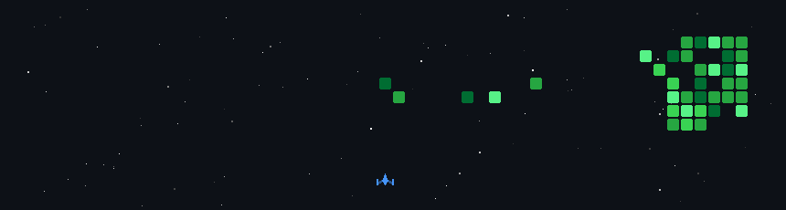

<div align="center">
  
</div>

<br>

## 👨‍💻 Sobre Mim

<table>
<tr>
<td width="50%" valign="top">

### 🎓 Informações Acadêmicas

```yaml
name: Paula Moschioni 
located_in: Minas Gerais, Brasil
current_job: Estudante
education: 1º período de Ciência da Computação - PUC-MG
```

### 🌍 Idiomas

- 🇧🇷 **Português**: Nativo
- 🇺🇸 **Inglês**: Avançado
- 🇪🇸 **Espanhol**: Avançado - Certificado B2 DELE

</td>
<td width="50%" valign="top">

### 💡 Áreas de Interesse

- 🌐 Web Development
- 📊 Data Structures
- 🧮 Algorithms
- 🎨 UI/UX Design

</td>
</tr>
</table>

<br>

<div align="center">
  
### 🔎 Aberta a oportunidades de estágio para aprender e evoluir!
[](mailto:paulamoschioni2007@gmail.com)
[](https://www.linkedin.com/in/paula-moschioni-9b54513b7)
[](https://www.instagram.com/paula.moschioni/)

</div>

<br>

---


## 🛠️ Tech Stack & Tools

<div align="center">

### 💻 Programming Languages

[](https://skillicons.dev)

### 🎨 Frontend Development

[](https://skillicons.dev)

### ⚙️ Backend Development

[](https://skillicons.dev)

### 🔧 Tools & Technologies

[](https://skillicons.dev)

</div>

<br>

---

## 🚀 Projetos em Destaque

<div align="center">

[](https://github.com/MatheusMeirellesGomes/AEDS-1)
[](https://github.com/MatheusMeirellesGomes/PRESENTEISA)

</div>

<br>

---

## 💭 Pensamento do Dia

<div align="center">


</div>

<br>

---

## 📈 Atividade Recente

<!--START_SECTION:activity-->
<!--END_SECTION:activity-->

<br>

---

## 👾 Space Shooter

<div align="center">



</div>

<br>

---


### 🎯 Visitor Count & Stats


[](https://github.com/paulamoschioni?tab=followers)


</div>

<br>

---

<div align="center">
  
### 💬 Let's Connect!

**Open to collaborations, internship opportunities, and interesting projects!**

[](mailto:paulamoschioni2007@gmail.com)
[](https://www.linkedin.com/in/paula-moschioni-9b54513b7)
[](https://www.instagram.com/paula.moschioni/)

</div>

<br>

<div align="center">
  


</div>


